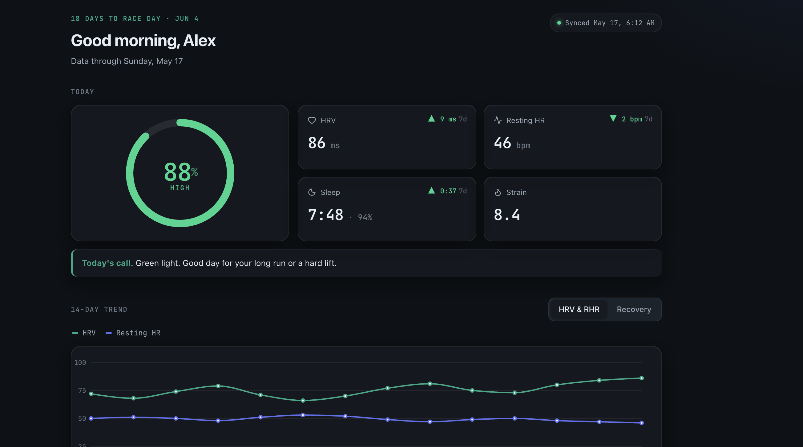

# 💪 WHOOP Dashboard & MCP Server

Getting a WHOOP has helped me reshape my physical/active life, but I felt I was missing something I always needed: guidance.
I wanted to learn more about WHAT the data meant, not just the collection. So, I made an MCP server that feeds into Claude, categorizes the
data, and a custom dashboard to help me get into running.

What is this project? A personal health data platform that syncs my WHOOP data into Postgres, surfaces it as a training dashboard, and exposes it to Claude through an MCP server so I can ask questions about my own biometrics and how it integrates into custom training plans.

Built because the WHOOP app shows you today, but not _why_ today looks the way it does.



**[Live demo](https://whoop-mcp-and-dashboard.vercel.app/)** · no login required, runs on mock data

---

## 📌 Table of Contents

- [Who This Is For](#who-this-is-for)
- [What It Does](#what-it-does)
- [How The Sync Works](#how-the-sync-works)
- [The Data Model](#the-data-model)
- [The Analytics](#the-analytics)
- [Asking Claude About Your Data](#asking-claude-about-your-data)
- [Quick Start](#quick-start)
- [Configuration](#configuration)
- [API Routes](#api-routes)
- [Deployment](#deployment)
- [Project Structure](#project-structure)
- [Known Limitations](#known-limitations)

---

## Who This Is For

**Athletes who want the "why":** WHOOP gives you a recovery score. This gives you the trend behind it; whether your easy runs are actually easy, whether your aerobic fitness is improving, and whether you're absorbing a taper.

**Developers building on WHOOP:** A complete, working reference for WHOOP API v2: OAuth 2.0 with refresh rotation, cursor pagination, HMAC-verified webhooks, and an idempotent sync pipeline.

**People curious about MCP:** A real Model Context Protocol server over both stdio and Streamable HTTP, so Claude Desktop, Claude Code, and claude.ai can all query the same dataset.

---

## What It Does

#### 📥 Ingestion

- Pulls recovery, sleep, and workout records from **WHOOP API v2**
- Daily scheduled sync plus **webhooks** for near-real-time updates
- Every write is an upsert, so cron and webhooks can both fire without creating duplicates

#### 📊 Dashboard

- Morning readout: recovery, HRV, resting heart rate, sleep, with deltas against your recent baseline
- 14-day trend charts for HRV, RHR, and recovery
- Training views: recent runs and lifts, weekly volume, half marathon readiness

#### 🧠 Analytics

- **Easy vs hard**: how much of your running is actually aerobic, against the 80/20 target
- **Aerobic efficiency**: whether the same heart rate is buying you more speed over time
- **Taper readiness**: whether HRV and resting heart rate say you're absorbing a taper

#### 🤖 AI Access

- MCP server exposing 4 tools so Claude can query the data conversationally

---

## How The Sync Works

Two paths write to the same tables, and both have to be safe to run twice.

#### 🔑 Authentication

OAuth 2.0 authorization code flow with 6 scopes (`read:recovery`, `read:sleep`, `read:workout`, `read:cycles`, `read:profile`, `offline`). A CSRF `state` parameter is generated per request and checked on callback. Access tokens are refreshed automatically when expired; WHOOP rotates the refresh token on every exchange.

#### 🔁 The daily pull

A Vercel Cron job hits `/api/cron/sync` at 05:00 UTC, authenticated with a bearer secret that Vercel injects automatically. It pulls the last 3 days and upserts everything.

#### The webhook path

WHOOP posts to `/api/whoop/webhook` when a record changes. Each request is verified with an **HMAC-SHA256 signature** over `timestamp + body`, compared in constant time, unsigned or tampered requests are rejected with a 401. Six event types are handled: `sleep.updated`, `workout.updated`, `recovery.updated`, and the three matching `.deleted` events.

Rather than re-pulling everything, the webhook fetches only the single changed record by ID.

---

## The Data Model

Five Prisma models on Postgres. Every table carries a `userId` so multi-user is a future migration rather than a rewrite.

| Model        | Holds                                             |
| ------------ | ------------------------------------------------- |
| `User`       | The single app user in v1                         |
| `Recovery`   | Daily recovery score, HRV, resting heart rate     |
| `Sleep`      | Performance %, time asleep, bedtime, nap flag     |
| `Workout`    | Sport, strain, avg/max HR, distance, time-in-zone |
| `WhoopToken` | Access + refresh tokens and expiry                |

Every row also stores the **raw provider payload** in a `raw` JSON column. That has already paid for itself twice: time-in-zone and sleep-stage data were available for analytics long before they were promoted to real columns.

The `Source` enum (`WHOOP`, `GARMIN`) is reserved so a second provider can be added without a schema redesign.

---

<a id="the-analytics"></a>

## The Analytics 🧮

#### Easy vs Hard (80/20)

Time-in-zone from every run, bucketed into easy (zones 1–2) and hard (zones 3–5). Zone 0 is reported but excluded from the ratio, because counting sub-50%-max-HR time as "easy" would flatter every run.

```
easyPct = easyMinutes / (easyMinutes + hardMinutes)
```

#### Aerobic Efficiency

Metres covered per minute, per heartbeat. Rising means the same effort is buying more speed.

```
efficiencyFactor = (metres / minutes) / averageHeartRate
```

#### Taper Readiness

Compares HRV and resting heart rate over the last 7 days against the prior baseline. Rising HRV plus falling RHR is the signature of absorbing a taper.

---

## Asking Claude About Your Data

The MCP server exposes **4 tools**:

| Tool                  | Returns                                                |
| --------------------- | ------------------------------------------------------ |
| `get_latest_readout`  | Most recent recovery, HRV, RHR, and last night's sleep |
| `get_recovery_trends` | Daily recovery, HRV, RHR over N days                   |
| `get_sleeps`          | Sleep records over N days                              |
| `get_workouts`        | Workouts over N days, optionally filtered by sport     |

**Local (Claude Code / Claude Desktop)** using stdio transport:

```json
{
	"mcpServers": {
		"whoop-data": {
			"command": "npx",
			"args": ["tsx", "mcp-server/index.ts"]
		}
	}
}
```

**Remote (claude.ai)** over Streamable HTTP. Add a custom connector pointing at:

```
https://your-app.vercel.app/api/mcp/<MCP_HTTP_SECRET>
```

The secret rides in the URL path because the connector UI has no header field. Treat that URL like a password.

---

## Quick Start

```bash
git clone https://github.com/HarrisonDlgf/whoop-mcp-and-dashboard.git
cd whoop-mcp-and-dashboard
npm install
cp .env.example .env     # fill this in, see Configuration below
npx prisma migrate dev
npm run dev
```

Then connect your WHOOP account at `/api/whoop/login` and run a first backfill.

---

## Configuration

| Variable              | Required | What it's for                                            |
| --------------------- | -------- | -------------------------------------------------------- |
| `DATABASE_URL`        | yes      | Neon Postgres connection string                          |
| `APP_SECRET`          | yes      | Gates the private dashboard and admin routes (16+ chars) |
| `WHOOP_CLIENT_ID`     | yes      | From the WHOOP developer dashboard                       |
| `WHOOP_CLIENT_SECRET` | yes      | Also signs incoming webhooks                             |
| `WHOOP_REDIRECT_URI`  | yes      | Must match the WHOOP app config exactly                  |
| `CRON_SECRET`         | prod     | Vercel sends this automatically as a bearer token        |
| `MCP_HTTP_SECRET`     | optional | Path segment for the remote MCP endpoint                 |

---

## API Routes

Eight route handlers.

| Route                 | Method   | Auth           | Purpose                                   |
| --------------------- | -------- | -------------- | ----------------------------------------- |
| `/api/whoop/login`    | GET      | session        | Starts the OAuth flow                     |
| `/api/whoop/callback` | GET      | state param    | Exchanges the code for tokens             |
| `/api/whoop/backfill` | GET      | `APP_SECRET`   | Manual sync, `?days=1..180`               |
| `/api/whoop/webhook`  | POST     | HMAC signature | Handles WHOOP change events               |
| `/api/whoop/debug`    | GET      | `APP_SECRET`   | Raw passthrough of the latest recovery    |
| `/api/cron/sync`      | GET      | `CRON_SECRET`  | Nightly 3-day sync                        |
| `/api/unlock`         | GET      | `APP_SECRET`   | Exchanges the secret for a session cookie |
| `/api/mcp/[secret]`   | GET/POST | path secret    | Remote MCP endpoint                       |

---

## Deployment

Vercel for the app, Neon for Postgres.

- Set every variable from [Configuration](#configuration) in the Vercel project, **Production** scope
- `vercel.json` registers the cron. Note that **cron jobs only run on production deployments**
- Environment variable changes need a redeploy to take effect
- Register the webhook URL in the WHOOP developer dashboard

---

<a id="project-structure"></a>

## 📁 Project Structure

```
whoop-mcp-and-dashboard/
├── app/
│   ├── _components/          # Dashboard UI
│   ├── api/                  # Route handlers
│   ├── dashboard/            # Private dashboard (gated)
│   └── page.tsx              # Public demo
├── lib/
│   ├── whoop/                # auth, api, mappers, sync, events
│   ├── dashboard.ts          # Analytics queries
│   ├── demo-data.ts          # Synthetic data for the public demo
│   └── db.ts                 # Prisma singleton
├── mcp-server/               # MCP server (stdio + HTTP)
└── prisma/schema.prisma      # Data model
```

---

## Known Limitations

Right now, this is built for just me. The schema can handle multiple users, but that part isn't built yet.

- **Single-user.** Everything writes to one hardcoded user ID. The schema is ready for multi-user; the code isn't.
- **Silent failures.** When the sync breaks or the OAuth expires, I do not have any notifications

---

**Created by Harrison Dolgoff**

Thanks to WHOOP for an open developer API
Built with help from Claude.
